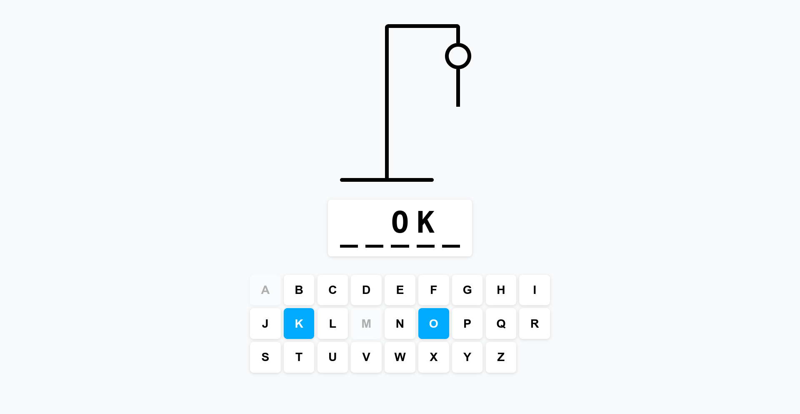
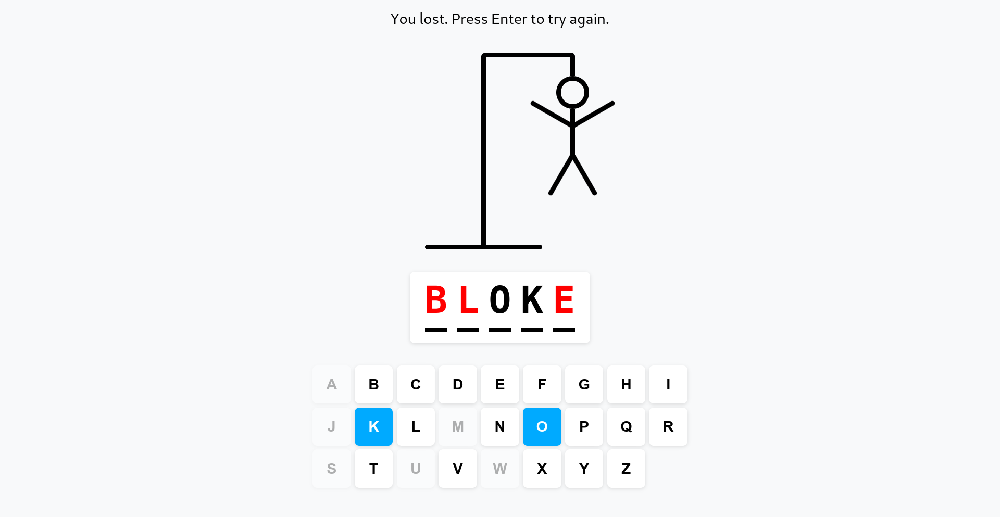

# Hangman Game (React + TypeScript + Vite)

## About

This project is a classic Hangman game developed using React.js and TypeScript. The main goal of this project is to practice and improve my coding skills with these two frameworks. Put together with Vite.

## Live Version

## Features

-   **Interactive UI:** Smooth and responsive user interface built with React components.
-   **Word Bank:** Guess words from a list of the thousand most popular English words.
-   **Flexible Input:** Guess letters using either the keyboard or on-screen buttons.

## Screenshots

## Run Locally

1. Clone the project to your local machine:

`git clone https://github.com/kaklewski/hangman-game`

2. Navigate to the project directory:

`cd hangman-game`

3. Install the dependencies:

`npm install`

4. Start the development server:

`npm run dev`

## Build with Vite

1. Build the dist:

`npm run build`

2. Preview the build:

`npm run preview`
